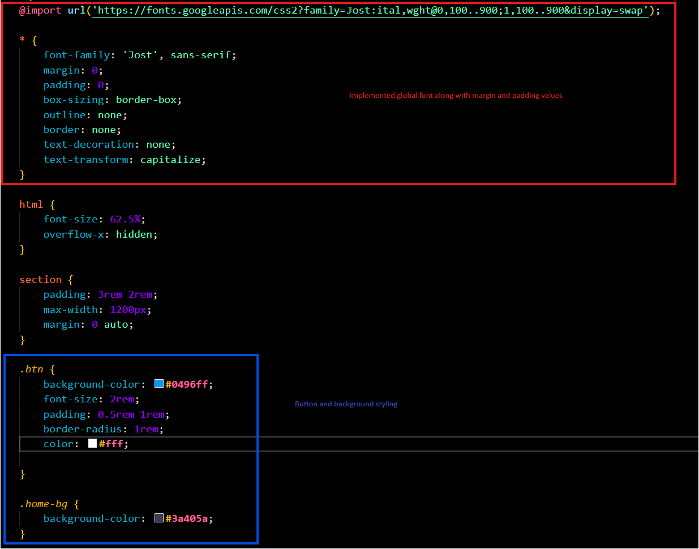

# Flexbox Hero Section Project

## Description 

- This project uses flexbox to create a hero section 
- There's a variety of flex attributes used in this project
- Implemented some fonts and styling for this project
- ### The purpose of this project is to better understand flexbox

- **This project was a following along from this youtube video 

## Here's how flexbox was used to create this result 
  

## Let's take a look at the styling 

### What I've learned 
I've learned some basic in regards to flexbox. As of right now it's still experimental, I haven't
grasped it yet to fully understand how to use it comfortably.

